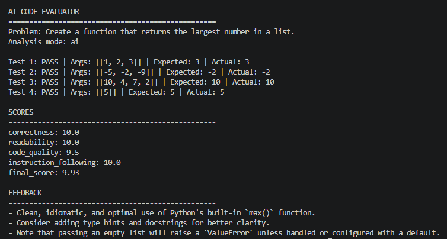
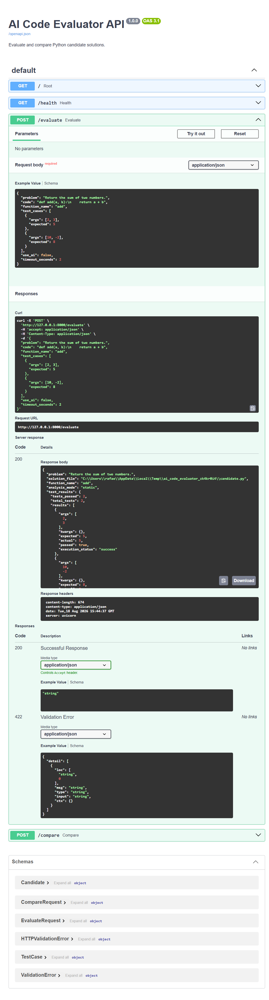
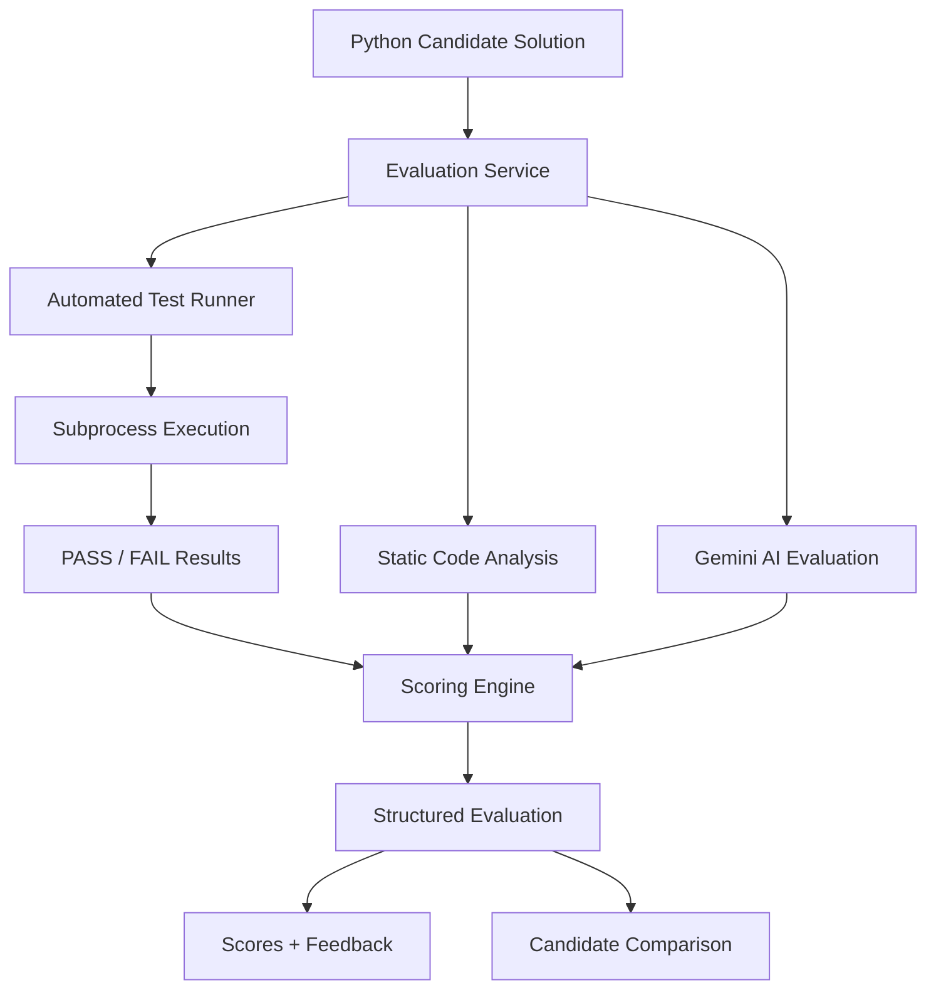

# AI Code Evaluator

**Automatically test, analyze, score, and compare Python solutions using deterministic tests, static analysis, and AI-assisted evaluation.**

The project was built to explore how programming solutions can be evaluated using a combination of **automated execution and LLM-based reasoning**.

---

## 🚀 What does it do?

Give the evaluator:

```python
def find_largest(numbers):
    return max(numbers)
```

along with a programming problem and test cases.

The system then:

```text
Runs the solution
→ Executes automated tests
→ Analyzes the source code
→ Optionally asks Gemini to evaluate it
→ Calculates structured scores
→ Returns technical feedback
```

It can also evaluate **two competing solutions and determine which one performs better**.

---

## 🎬 Demo

### AI-assisted evaluation



### REST API



---

## ⚙️ Evaluation Pipeline



---

## 🧠 Evaluation Criteria

The evaluator produces scores for:

| Metric | Weight |
|---|---:|
| Correctness | 55% |
| Readability | 15% |
| Code Quality | 15% |
| Instruction Following | 15% |

The final result contains:

```text
Correctness
Readability
Code Quality
Instruction Following
Final Score
Technical Feedback
```

---

## 🔍 Example Workflow

Input problem:

```text
Create a function that returns the largest number in a list.
```

Candidate:

```python
def find_largest(numbers):
    return max(numbers)
```

Test cases:

```json
[
  {
    "args": [[1, 2, 3]],
    "expected": 3
  },
  {
    "args": [[-5, -2, -9]],
    "expected": -2
  }
]
```

Run:

```bash
python -m src.evaluator examples/example.json --ai
```

The evaluator executes the candidate, verifies the tests, performs code analysis, and produces a structured evaluation.

---

## 🆚 Compare Two Solutions

The project can evaluate two implementations of the same programming problem.

```bash
python -m src.compare examples/example.json examples/bad_example.json
```

Example:

```python
# Candidate A
def find_largest(numbers):
    return max(numbers)
```

```python
# Candidate B
def find_largest(numbers):
    return numbers[0]
```

The evaluator runs both candidates against the same test cases and compares:

- correctness
- readability
- code quality
- instruction following
- final score

It then reports:

```text
Winner: Candidate A
```

---

## ✨ Features

- Dynamic Python solution loading
- Generic positional arguments with `*args`
- Keyword arguments with `**kwargs`
- Automated candidate testing
- PASS/FAIL reporting
- Separate candidate subprocess
- Configurable execution timeout
- Error handling
- Static source-code analysis
- Weighted scoring
- Gemini-assisted evaluation
- Structured AI responses with Pydantic
- A/B candidate comparison
- REST API with FastAPI
- Automated tests with pytest
- Continuous Integration with GitHub Actions

---

## 🏗️ Project Structure

```text
ai-code-evaluator/
│
├── src/
│   ├── ai_evaluator.py
│   ├── api.py
│   ├── candidate_worker.py
│   ├── comparator.py
│   ├── compare.py
│   ├── evaluation_service.py
│   ├── evaluator.py
│   ├── process_runner.py
│   ├── scoring.py
│   ├── solution_loader.py
│   ├── static_analysis.py
│   ├── submission_service.py
│   └── test_runner.py
│
├── tests/
├── examples/
├── docs/
│   └── images/
├── .github/
│   └── workflows/
├── README.md
├── SECURITY.md
└── requirements.txt
```

---

## 🛠️ Installation

```bash
git clone https://github.com/Rafael-Luna3/ai-code-evaluator.git
cd ai-code-evaluator
python -m venv .venv
```

Windows PowerShell:

```powershell
.\.venv\Scripts\Activate.ps1
```

Install dependencies:

```bash
python -m pip install -r requirements.txt
```

---

## 💻 CLI Usage

Standard evaluation:

```bash
python -m src.evaluator examples/example.json
```

JSON output:

```bash
python -m src.evaluator examples/example.json --json
```

---

## 🤖 AI-Assisted Evaluation

Set your Gemini API key:

```powershell
$env:GEMINI_API_KEY="YOUR_API_KEY"
```

Run:

```bash
python -m src.evaluator examples/example.json --ai
```

---

## 🌐 REST API

Start the API:

```bash
fastapi dev src/api.py
```

Interactive documentation:

```text
http://127.0.0.1:8000/docs
```

Available endpoints:

```text
GET  /health
POST /evaluate
POST /compare
```

---

## 🧪 Automated Testing

Run:

```bash
python -m pytest
```

The project includes tests for:

- scoring
- candidate execution
- timeouts
- solution loading
- static analysis
- evaluation service
- candidate comparison
- AI response validation
- REST API
- CLI evaluation

---

## 🔐 Security

Candidate Python code is executed in a separate subprocess with a configurable timeout.

This helps protect against hanging executions such as:

```python
while True:
    pass
```

However, subprocess execution is **not a complete security sandbox**.

See [`SECURITY.md`](SECURITY.md).

---

## 🧰 Tech Stack

- Python
- FastAPI
- Gemini API
- Google GenAI SDK
- pytest
- Pydantic
- Python AST
- subprocess
- JSON
- Git
- GitHub
- GitHub Actions

---

## 📌 Version

**v1.0.0**